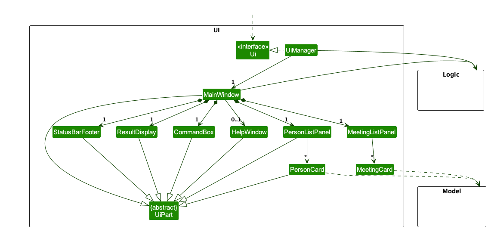
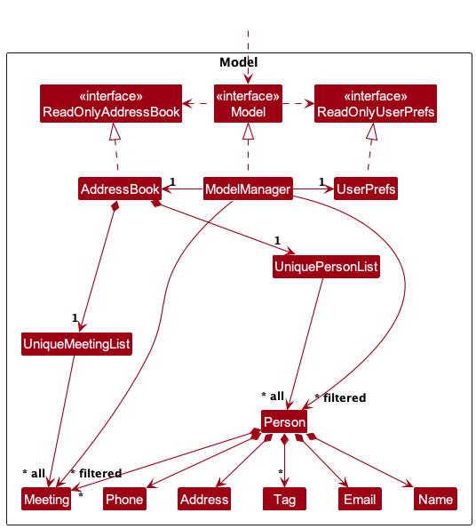

# FinCliq - Developer Guide

## Table of Contents
1. [Acknowledgements](#acknowledgements)
2. [Setting up, getting started](#setting-up-getting-started)
3. [Design](#design)
    - 3.1. [Architecture](#architecture)
    - 3.2. [UI Component](#ui-component)
    - 3.3. [Logic Component](#logic-component)
    - 3.4. [Model Component](#model-component)
    - 3.5. [Storage Component](#storage-component)
    - 3.6. [Common Classes](#common-classes)
4. [Implementation](#implementation) 
   - 4.1. [Release v1.2](#release-v12) 
     * 4.1.1. [Add Meeting feature](#add-meeting-feature)
     * 4.1.2. [Edit Meeting feature](#edit-meeting-feature)
     * 4.1.3. [Delete Meeting feature](#delete-meeting-feature)
     * 4.1.4. [View Client feature](#view-client-feature) 
   - 4.2. [Release v1.3](#release-v13) 
     * 4.2.1 [Filter feature](#filter-feature) 
5. [Appendix: Requirements](#appendix-requirements)
6. [Appendix: Instructions for manual testing](#appendix-instructions-for-manual-testing)
7. [Appendix: Planned enhancements](#appendix-planned-enhancements)
8. [Appendix: Effort](#appendix-effort)

---

## **Acknowledgements**

- This project is based on the AddressBook-Level3 project created by the [SE-EDU initiative](https://se-education.org).
- Third-party libraries used:
    - [JavaFX](https://openjfx.io/) for the GUI
    - [JUnit 5](https://junit.org/junit5/) for testing
    - [Jackson](https://github.com/FasterXML/jackson) for serializing and deserializing JSON data

---

## **Setting up, getting started**

Refer to the guide [_Setting up and getting started_](SettingUp.md).

---

## **Design**

### Architecture

The **_Architecture Diagram_** given above explains the high-level design of the App.

Given below is a quick overview of main components and how they interact with each other.

**Main components of the architecture**

**`Main`** (consisting of classes [`Main`](https://github.com/AY2324S2-CS2103-F08-1/tp/blob/master/src/main/java/seedu/address/Main.java) and [`MainApp`](https://github.com/AY2324S2-CS2103-F08-1/tp/blob/master/src/main/java/seedu/address/MainApp.java)) is in charge of the app launch and shut down.

- At app launch, it initializes the other components in the correct sequence, and connects them up with each other.
- At shut down, it shuts down the other components and invokes cleanup methods where necessary.

The bulk of the app's work is done by the following four components:

- [**`UI`**](#ui-component): The UI of the App.
- [**`Logic`**](#logic-component): The command executor.
- [**`Model`**](#model-component): Holds the data of the App in memory.
- [**`Storage`**](#storage-component): Reads data from, and writes data to, the hard disk.

[**`Commons`**](#common-classes) represents a collection of classes used by multiple other components.

**How the architecture components interact with each other**

The _Sequence Diagram_ below shows how the components interact with each other for the scenario where the user issues the command `delete 1`.

Each of the four main components (also shown in the diagram above),

- defines its _API_ in an `interface` with the same name as the Component.
- implements its functionality using a concrete `{Component Name}Manager` class (which follows the corresponding API `interface` mentioned in the previous point.

For example, the `Logic` component defines its API in the `Logic.java` interface and implements its functionality using the `LogicManager.java` class which follows the `Logic` interface. Other components interact with a given component through its interface rather than the concrete class (reason: to prevent outside component's being coupled to the implementation of a component), as illustrated in the (partial) class diagram below.

The sections below give more details of each component.

### UI component

The **API** of this component is specified in [`Ui.java`](https://github.com/AY2324S2-CS2103-F08-1/tp/blob/master/src/main/java/seedu/address/ui/Ui.java)

The UI consists of a `MainWindow` that is made up of parts e.g.`CommandBox`, `ResultDisplay`,
`PersonListPanel`, `MeetingListPanel`, `StatusBarFooter` etc. All these, including the
`MainWindow`,
inherit from the abstract `UiPart` class which captures the commonalities between classes that represent parts of the visible GUI.

The `UI` component uses the JavaFx UI framework. The layout of these UI parts are defined in matching `.fxml` files that are in the `src/main/resources/view` folder. For example, the layout of the [`MainWindow`](https://github.com/AY2324S2-CS2103-F08-1/tp/blob/master/src/main/java/seedu/address/ui/MainWindow.java) is specified in [`MainWindow.fxml`](https://github.com/AY2324S2-CS2103-F08-1/tp/blob/master/src/main/java/seedu/address/ui/MainWindow.java)

The `UI` component,

* executes user commands using the `Logic` component.
* keeps a reference to the `Logic` component, because the `UI` relies on the `Logic` to execute commands.
* depends on some classes in the `Model` component, as it displays `Person`, `Meeting`,
  objects residing in the `Model`.
* uses the façade pattern to provide a unified interface to the other components.
* uses the observer pattern to listen for changes in the `Model` and update the UI accordingly.

### Logic component

**API** : [`Logic.java`](https://github.com/AY2324S2-CS2103-F08-1/tp/blob/master/src/main/java/seedu/address/logic/Logic.java)

Here's a (partial) class diagram of the `Logic` component:

The sequence diagram below illustrates the interactions within the `Logic` component, taking `execute("delete 1")` API call as an example.

:information_source: **Note:** The lifeline for `DeleteCommandParser` should end at the destroy marker (X) but due to a limitation of PlantUML, the lifeline continues till the end of diagram.

How the `Logic` component works:

1. When `Logic` is called upon to execute a command, it is passed to an `AddressBookParser` object which in turn creates a parser that matches the command (e.g., `DeleteCommandParser`) and uses it to parse the command.
1. This results in a `Command` object (more precisely, an object of one of its subclasses e.g., `DeleteCommand`) which is executed by the `LogicManager`.
1. The command can communicate with the `Model` when it is executed (e.g. to delete a person). 
   Note that although this is shown as a single step in the diagram above (for simplicity), in the code it can take several interactions (between the command object and the `Model`) to achieve.
1. The result of the command execution is encapsulated as a `CommandResult` object which is returned back from `Logic`.

Here are the other classes in `Logic` (omitted from the class diagram above) that are used for parsing a user command:

How the parsing works:

- When called upon to parse a user command, the `AddressBookParser` class creates an `XYZCommandParser` (`XYZ` is a placeholder for the specific command name e.g., `AddCommandParser`) which uses the other classes shown above to parse the user command and create a `XYZCommand` object (e.g., `AddCommand`) which the `AddressBookParser` returns back as a `Command` object.
- All `XYZCommandParser` classes (e.g., `AddCommandParser`, `DeleteCommandParser`, ...) inherit from the `Parser` interface so that they can be treated similarly where possible e.g, during testing.

### Model component

**API** : [`Model.java`](https://github.com/AY2324S2-CS2103-F08-1/tp/blob/master/src/main/java/seedu/address/model/Model.java)

The `Model` component,

- stores the address book data i.e., all `Person` and `Meeting`  objects (which are contained in
  `UniquePersonList` and `UniqueMeetingList` objects respectively).
- stores the currently 'selected' `Person` objects (e.g., results of a search query) as a separate _filtered_ list which is exposed to outsiders as an unmodifiable `ObservableList<Person>` that can be 'observed' e.g. the UI can be bound to this list so that the UI automatically updates when the data in the list change.
- stores the currently 'selected' `Meeting` objects (e.g., results of a search query) as a separate _filtered_ list which is exposed to outsiders as an unmodifiable `ObservableList<Meeting>` that can be 'observed' e.g. the UI can be bound to this list so that the UI automatically updates when the data in the list change.
- stores a `UserPref` object that represents the user’s preferences. This is exposed to dd the outside as a `ReadOnlyUserPref` objects.
- does not depend on any of the other three components (as the `Model` represents data entities of the domain, they should make sense on their own without depending on other components)

### Storage component

**API** : [`Storage.java`](https://github.com/AY2324S2-CS2103-F08-1/tp/blob/master/src/main/java/seedu/address/storage/Storage.java)

The `Storage` component,

- can save both address book data and user preference data in JSON format, and read them back into corresponding objects.
- inherits from both `AddressBookStorage` and `UserPrefStorage`, which means it can be treated as either one (if only the functionality of only one is needed).
- depends on some classes in the `Model` component (because the `Storage` component's job is to save/retrieve objects that belong to the `Model`)

### Common classes

Classes used by multiple components are in the `seedu.addressbook.commons` package.

---

## **Implementation**

This section describes some noteworthy details on how certain features are implemented.

### Release v1.2

### Add Meeting feature

#### Implementation

**The `AddMeetingCommand` is implemented as such:**

- `LogicManager`'s execute method is called with the command string which then calls the `parseCommand()` method of `AddressBookParser`
- `AddressBookParser` then creates a `AddMeetingCommandParser` which parses the user input and
  returns a `AddMeetingCommand`
- The created `AddMeetingCommand` is then executed by the `LogicManager`
- `AddMeetingCommand` adds the meeting to the client's meeting list corresponding to the index provided by the user.
- The UniqueMeetingList object in the Model is updated with the new meeting
- `AddMeetingCommand` creates a `CommandResult` object and returns it to `LogicManager`
- `LogicManager` then passes `CommandResult` to `UI` who then displays the `Meeting` list with the added meeting

**The `AddMeetingCommandParser` is implemented as such:**

- Takes in a `String` input from the user
- Splits the given `String` and checks if there is more than 1 string provided
    - If more than 1 string was provided, throws `ParseException`
      -Parser then checks if required prefixes are provided
    - If not, throws `ParseException`
- Parser then checks if an empty string was provided
    - If yes, throws `ParseException`
- Parser then checks if duplicate prefixes are provided
    - If yes, throws `ParseException`
- Parser then checks if the date, time, description and client index are valid
    - If not, throws `ParseException`
- If no exception was thrown, the index corresponding to the `Person`, the date, time and description are used to create a `AddMeetingCommand` object

#### Sequence Diagram

The following activity diagrams show how the `AddMeetingCommand` and `AddMeetingCommandParser` are executed in the event of valid and invalid user input.

The first diagram shows how the AddMeetingCommandParser works when valid and invalid user input is given: 

The second diagram shows how the AddMeetingCommand is executed when the user inputs a valid and invalid command: 

#### Design considerations:

**Aspect: How add meeting executes:**

- **Alternative 1 (current choice):** Adds the meeting based on the client index, date, time and description provided by the user
    - Pros:
        * More realistic as we would need to consider for conflicting meetings for the same client.
        * Easier to visualise the different scenarios that could happen.
    - Cons:
        * More complex to implement.
        * More error-prone as the user needs to provide the date and time.

- **Alternative 2:** Adds the meeting based on the date and time provided by the user
    - Pros:
        * More flexible.
        * More user-friendly.
    - Cons:
        * Unable to add meetings based on other criteria such as client index, description, etc.
        * Less realistic as we would need to consider for conflicting meetings for the same client.

### Edit Meeting feature

#### Implementation

**The `EditMeetingCommand` is implemented as such:**

- `LogicManager`'s execute method is called with the command string which then calls the `parseCommand()` method of `AddressBookParser`
- `AddressBookParser` then creates a `EditMeetingCommandParser` which parses the user input and
  returns a `EditMeetingCommand`
- The created `EditMeetingCommand` is then executed by the `LogicManager`
- `EditMeetingCommand` edits the meeting of the client corresponding to the indices provided
  by the user.
- `EditMeetingCommand` creates a `CommandResult` object and returns it to `LogicManager`
- `LogicManager` then passes `CommandResult` to `UI` who then displays the new `Meeting` list

**The `EditMeetingCommandParser` is implemented as such:**

- Takes in a `String` input from the user
- Splits the given `String` based on the prefixes.
    - If one or more prefixes are missing, throws `ParseException`
- Parser then checks if an empty string was provided
    - If yes, throws `ParseException`
- If no exception was thrown, the indices corresponding to the `Person` and the `Meeting`
  are used to create a `EditMeetingCommand` object

The following activity diagram summarises what happens when a user executes the `editMeeting` command:

#### Design considerations:

**Aspect: How edit meeting executes:**

* **Alternative 1 (current choice):** Edits the meeting by directly modifying the current meeting
    - Pros:
        * Easier to implement.
    - Cons:
        * May cause unwanted side effects such as two different meetings (addressbook and client) being modified

### Delete Meeting feature

#### Implementation

**The `DeleteMeetingCommand` is implemented as such:**

- `LogicManager`'s execute method is called with the command string which then calls the `parseCommand()` method of `AddressBookParser`
- `AddressBookParser` then creates a `DeleteMeetingCommandParser` which parses the user input and
  returns a `DeleteMeetingCommand`
- The created `DeleteMeetingCommand` is then executed by the `LogicManager`
- `DeleteMeetingCommand` deletes the meeting of the client corresponding to the indices provided
  by the user.
- `DeleteMeetingCommand` creates a `CommandResult` object and returns it to `LogicManager`
- `LogicManager` then passes `CommandResult` to `UI` who then displays the `Meeting` list without
  the deleted meeting

**The `DeleteMeetingCommandParser` is implemented as such:**

- Takes in a `String` input from the user
- Splits the given `String` and checks if there is more than 1 string provided
    - If more than 1 string was provided, throws `ParseException`
- Parser then checks if an empty string was provided
    - If yes, throws `ParseException`
- If no exception was thrown, the indices corresponding to the `Person` and the `Meeting`
  are used to create a `DeleteMeetingCommand` object

#### Sequence Diagram

The following sequence diagrams show how the `DeleteMeetingCommand` is executed when the user
inputs the command `deleteMeeting clientIndex/2 meetingIndex/2`.

The first diagram shows how the command goes through the `Logic` component: 

:information_source: **Note:** The lifelines for
`DeleteMeetingCommandParser` and `DeleteMeetingCommand` should end at the destroy marker (X) but due
to a limitation of PlantUML, the lifelines reach the end of the diagram.

Similarly, the second diagram shows how the command goes through the `Model` component: 

:information_source: **Note:** The indices of the
meeting and person are converted to zero-based indices by the `ModelManager` class, using
`Index#getZeroBased()`.

The following activity diagram summarises what happens when a user executes the `deleteMeeting` command:

#### Design considerations:

**Aspect: How delete meeting executes:**

* **Alternative 1 (current choice):** Deletes the meeting based on the index provided by the user
    - Pros:
        * Easier to implement.
        * Less error-prone as the user only needs to provide the index.
        * Users have to type less to enter the index.
    - Cons:
        * Unable to delete meetings based on other criteria such as date, time, etc.
        * Less flexible.
        * Less user-friendly.

* **Alternative 2:** Deletes the meeting based on the date and time provided by the user
    - Pros:
        * Able to delete meetings based on date and time.
        * More flexible.
        * More user-friendly.
    - Cons:
        * More complex to implement.
        * More error-prone as the user needs to provide the date and time.
        * Users have to type more to enter the date and time.

### View Client feature

#### Implementation

**The `ViewClientCommand` is implemented as such:**

- `LogicManager`'s execute method is called with the command string which then calls the `parseCommand()` method of `AddressBookParser`
- `AddressBookParser` then creates a `ViewCommandParser` which parses the user input and
  returns a `ViewClientCommand`
- The created `ViewClientCommand` is then executed by the `LogicManager`
- `ViewClientCommand` filters through the list of `Person` based on the index provided by the user.
- `ViewClientCommand` creates a `CommandResult` object and returns it to `LogicManager`
- `LogicManager` then passes `CommandResult` to `UI` who then displays the new `Person` as well as the person's `Meetings`

**The `ViewCommandParser` is implemented as such:**

- Takes in a `String` input from the user
- Splits the given `String` based on the prefixes.
    - If one or more prefixes are missing, throws `ParseException`
- Parser then checks if an empty string was provided
    - If yes, throws `ParseException`
- Parser then checks if the prefix `c` is given
    - If no, throws `ParseException`
- If no exception was thrown, the index corresponding to the `Person` is used to create a `ViewClientCommand` object

The following activity diagram summarises what happens when a user executes the `ViewClientCommand` command:

The following sequence diagram summarises what happens when a user executes the `ViewClientCommand` command:

:information_source: **Note:** The lifelines for
`ViewCommandParser` should end at the destroy marker (X) but due to a limitation of PlantUML, the lifelines reach the end of the diagram.

#### Design considerations:

**Aspect: How ViewClientCommand executes:**

* **Alternative 1 (current choice):** Views the client based on the given index as well as a prefix `c`
    - Pros:
        * Easier to implement.
        * Built in OOP fashion with a parent `ViewCommand` class, this allows us to expand to other `View` methods such as `ViewMeeting` in the future

### Release v1.3

### Filter feature

#### Implementation

**The `FilterCommand` is implemented as such:**

- `LogicManager`'s execute method is called with the command string which then calls the `parseCommand()` method of `AddressBookParser`
- `AddressBookParser` then creates a `FilterCommandParser` which parses the user input and returns a `FilterCommand`
- The created `FilterCommand` is then executed by the `LogicManager`
- `FilterCommand` filters the list of `Person` based on the tag provided by the user
- `FilterCommand` creates a `CommandResult` object and returns it to `LogicManager`
- `LogicManager` then passes `CommandResult` to `UI` who then displays the `Person` list filtered by the `Tag` provided

**The `FilterCommandParser` is implemented as such:**

- Takes in a `String` input from the user
- Splits the given `String` and checks if there is more than 1 string provided
    - If more than 1 string was provided, throws `ParseException`
- Parser then checks if an empty string was provided
    - If yes, throws `ParseException`
- If no exception was thrown, a `Tag` object is created which is then used to create a `FilterCommand` object

#### Sequence Diagram

:information_source: **Note:** The lifeline for `FilterCommandParser` should end at the destroy marker (X) but due to a limitation of PlantUML, the lifeline continues till the end of diagram.

The details of the reference frame can be found in the sequence diagram below.

#### Design considerations:

**Aspect: How FilterCommandParser executes:**

- **Alternative 1 (current choice):** Filters based on only one `Tag`

    - Pros: Easy to implement.
    - Cons: Unable to search for clients who possess more than one `Tag`

- **Alternative 2:** Filters by multiple `Tag`
    - Pros: Able to search for client with multiple `Tag`
    - Cons: Error prone for a method used for a niche instance.

## **Documentation, logging, testing, configuration, dev-ops**

- [Documentation guide](Documentation.md)
- [Testing guide](Testing.md)
- [Logging guide](Logging.md)
- [Configuration guide](Configuration.md)
- [DevOps guide](DevOps.md)

---

## **Appendix: Requirements**

### Product scope

**Target user profile**:

- has a need to manage a significant number of clients
- has a need to manage a significant number of meetings
- has a need to classify clients into different categories
- prefers desktop apps over other types of apps
- can type fast (50 wpm or more)
- prefers typing to mouse interactions
- is reasonably comfortable using CLI apps

**Value proposition**: A CLI designed specifically for financial advisors to revolutionise the way they manage, schedule, filter and rank their clients. Addresses the day-to-day challenges faced by financial advisors but also provides strategic value through its ranking and leaderboard features. It's a companion that empowers financial advisors to scale to new heights.

### User stories

Priorities: High (must have) - `* * *`, Medium (nice to have) - `* *`, Low (unlikely to have) - `*`

| Priority | As a …                 | I want to …                               | So that I can…                                                |
|----------|------------------------|-------------------------------------------|---------------------------------------------------------------|
| `* * *`  | As a financial advisor | add new clients profiles to my list       | keep track of the clients under me                            |
| `* * *`  | As a financial advisor | edit the profiles of my clients           | keep their information up to date                             |
| `* * *`  | As a financial advisor | delete the clients under me               | remove clients that are no longer under me                    |
| `* * *`  | As a financial advisor | view all my client profiles               | track all my clients in one place                             |
| `* * *`  | As a financial advisor | filter client by their tags               | track clients with similar demographics                       |
| `* * *`  | As a financial advisor | add client meetings                       | keep track of my schedule                                     |
| `* * *`  | As a financial advisor | update client meetings                    | revise my schedule and alter for reasons                      |
| `* * *`  | As a financial advisor | view a specific client and their meetings | so I can prepare for the materials for the client accordingly |
| `* *`    | As a financial advisor | search my meetings by date or agenda      | locate meetings with specific filters                         |
| `* *`    | As a financial advisor | filter my meetings by date                | so I can know the meetings of that day                        |
| `*`      | As a financial advisor | sort persons by name                      | locate a person easily                                        |

### Use cases

(For all use cases below, the **System** is the `FinCliq` and the **Actor** is the `user`, unless specified otherwise)

**Use Case: Add New Client Profiles**

**MSS:**
1. Financial advisor requests to add a new client profile to their list.
2. FinCliq adds the new client profile to the advisor's list.
3. FinCliq confirms the successful addition of the client profile.
    - Use case ends.

**Extensions:**
- 1a. The financial advisor does not provide necessary client information.
    - 1a1. FinCliq detects missing information.
    - 1a2. FinCliq prompts the financial advisor to provide the missing information.
    - Use case resumes from step 1.
- 1b. The financial advisor attempts to add a client profile that already exists.
    - 1b1. FinCliq detects duplicate profile.
    - 1b2. FinCliq notifies the financial advisor about the existing profile.
    - Use case ends.

**Use Case: Edit Client Profiles**

**MSS:**
1. Financial advisor requests to edit the profile of a client.
2. FinCliq retrieves the client's profile for editing.
3. Financial advisor updates the necessary information.
4. FinCliq saves the changes to the client's profile.
5. FinCliq confirms the successful update of the client's profile.
    - Use case ends.

**Extensions:**
- 1a. The financial advisor tries to edit a non-existent client profile.
    - 1a1. FinCliq detects the absence of the client profile.
    - 1a2. FinCliq notifies the financial advisor about the non-existence of the client profile.
    - Use case ends.
- 1b. The financial advisor attempts to edit the profile with invalid information.
    - 1b1. FinCliq detects invalid information.
    - 1b2. FinCliq prompts the financial advisor to provide valid information.
    - Use case resumes from step 3.

**Use Case: Delete Clients**

**MSS:**
1. Financial advisor requests to delete a client from their list.
2. FinCliq removes the specified client from the advisor's list.
3. FinCliq confirms the successful deletion of the client.
    - Use case ends.

**Extensions:**
- 1a. The financial advisor tries to delete a non-existent client.
    - 1a1. FinCliq detects the absence of the client.
    - 1a2. FinCliq notifies the financial advisor about the non-existence of the client.
    - Use case ends.

**Use Case: View All Client Profiles**

**MSS:**
1. Financial advisor requests to view all client profiles.
2. FinCliq retrieves and displays all client profiles associated with the advisor.
    - Use case ends.

**Use Case: Add Client Meetings**

**MSS:**
1. Financial advisor requests to add a meeting with a client to their schedule.
2. FinCliq adds the meeting to the list of meeting as well as to the client's list of meetings
3. FinCliq confirms the successful addition of the meeting
    - Use case ends.

**Extensions**
- 1a. Financial Advisor tries to add a duplicate meeting
    - 1a1. FinCliq detects the duplicate meeting entry
    - 1a2. FinCliq notifies the financial advisor and does not add the meeting
    - Use case ends
- 1b. Financial Advisor tries to add meeting with date earlier than current date
    - 1b1. FinCliq detects the invalid date
    - 1b2. FinCliq informs financial advisor of the invalid date
    - Use case ends

**Use Case: View a specific client**

**MSS:**
1. Financial advisor requests to view a client by a specified index.
2. FinCliq retrieves and displays that specific client as well as all of his/her associated meetings.
    - Use case ends.

**Use Case: Update existing Meetings**

**MSS:**
1. Financial advisor requests to update a specific meeting's details.
2. FinCliq retrieves and updates meeting's details.
3. FinCliq displays updated meeting to the advisor.
    - Use case ends.

**Use Case: Delete Meeting**

**MSS:**
1. Financial advisor requests to delete a specific client's meeting
2. FinCliq retrieves and updates meeting's details
3. FinCliq displays successful deletion message
    - Use case ends

**Use Case: Filter Clients by Tag**

**MSS:**
1. Financial advisor requests to filter meetings by a tag by inputting the name of the tag.
2. FinCliq filters clients based on the specified tag
3. FinCliq displays the filtered clients to the financial advisor.
    - Use case ends.

### Non-Functional Requirements

1.  Should work on any _mainstream OS_ as long as it has Java `11` or above installed.
1.  Should be able to hold up to 1000 persons without a noticeable sluggishness in performance for
    typical usage.
1.  Should be able to hold up to 10 meetings per client without a noticeable sluggishness in
    performance for typical usage.
1.  A user with above average typing speed for regular English text (i.e. not code, not system
    admin commands) should be able to accomplish most of the tasks faster using commands than using the mouse.
1.  A user should be able to use the system without much guidance.
1.  The application should only require a standalone executable file to run. No other software should be required to be installed.
1.  The system should respond within 3 seconds to ensure smooth user experience.

### Glossary

- **Financial Advisor (FA)**: A user of the FinCliq app who provides financial advice and services to clients.
- **Client**: An individual who seeks financial advice and potentially uses the services of a user of the FinCliq platform.
- **Meeting**: A scheduled interaction between a Financial Advisor and a Client. Can be virtual or in-person.
- **Meeting Notes**: Textual records or summaries of discussions and decisions made during a meeting.
- **Use Case**: A description of a specific user goal or task and the steps required to achieve it.
- **Mainstream OS**: Windows, Linux, Unix, MacOS
- **Private contact detail**: A contact detail that is not meant to be shared with others
- **CLI**: A command line interface (CLI) is a software mechanism you use to interact with your
  operating system using your keyboard.

---

## **Appendix: Instructions for manual testing**

Given below are instructions to test the app manually.

:information_source: **Note:** These instructions only provide a starting point for testers to work on;
testers are expected to do more *exploratory* testing.

### Launch and shutdown

1. Initial launch

    1. Download the jar file and copy into an empty folder

    1. Double-click the jar file Expected: Shows the GUI with a set of sample contacts. The window size may not be optimum.

1. Saving window preferences

    1. Resize the window to an optimum size. Move the window to a different location. Close the window.

    1. Re-launch the app by double-clicking the jar file. 
       Expected: The most recent window size and location is retained.

### Adding a client

1. Adding a client with all fields

    1. Prerequisites: Adding the client should not result in duplicate clients.

    1. Test case: `add n/John Doe p/98765432 e/johnd@example.com a/311, Clementi Ave 2, #02-25
       t/friends t/owesMoney`  
       Expected: A new client is added to the list. The client's details are shown in the
       list, and the status bar shows the client's details.

    1. Test case: `add n/Jane Doe p/87654321` 
       Expected: Given client is not added. Error details shown in status message.

    1. Other incorrect add commands to try: `add`, `add n/John Doe`, `add n/John Doe o/98765432`,
       `...` 
       Expected: Similar to previous.

### Editing a client

1. Editing a client's details in the client list

    1. Prerequisites: At least 1 client in the client list

    1. Test case: `edit 1 p/91234567 e/johndoe@example.com`  
       Expected: The client's details are updated in the list. The updated meeting's
       details are shown in the list, and the status bar shows the client's details.

    1. Test case: `edit 0 p/91234567`  
       Expected: No client is edited. Error details shown in the status message. Status bar
       remains the same.

    1. Other incorrect edit commands to try: `edit`, `edit x`, `edit x p/91234567` (where x is
       larger than the list size) 
       Expected: Similar to previous.

### Deleting a client

1. Deleting a client while all clients are being shown

    1. Prerequisites: List all clients using the `list` command. Multiple clients in the list.

    1. Test case: `delete 1` 
       Expected: First client is deleted from the list. Details of the deleted client shown in the status message. Timestamp in the status bar is updated.

    1. Test case: `delete 0` 
       Expected: No client is deleted. Error details shown in the status message. Status bar remains the same.

    1. Other incorrect delete commands to try: `delete`, `delete x`, `...` (where x is larger than the list size) 
       Expected: Similar to previous.

### View a specific client

1. View a client based on an index provided

    1. Prerequisites: At least 1 client in client list

    2. Test case: `view c [index not in list]`
       Expected: No client is shown. Error details that index provided is invalid in status message.
    3. Test case: `view c [valid index]` followed by `view c [valid index]`
       Expected: No new client is shown. Error details to request user to go back to home page by using `list` command
    4. Test case: `view c [valid index]`
       Expected: Shows the client with the index provided as well as all his/her associated meetings.
    5. Other incorrect view commands to try: `view`, `view [any character] [any number]`

### Filter client by tag

1. Filters through list of clients by a Tag provided

    1. Prerequisites: At least 1 client in client list

    2. Test case: `filter friends`
       Expected: Shows all clients who have the tag "friends"

    3. Test case: `filter [invalid tag]`
       Expected: Shows all clients. Error details that tag provided does not belong to any client.

    4. Test case: `filter [tag_1] [tag_2]`
       Expected: Error thrown to tell user to only input a singular Tag

### Adding a meeting

1. Adding a meeting with all fields

    1. Prerequisites: Adding the meeting should not result in duplicate meetings, and the client
       index should be listed in the client list.

    1. Test case: ` addMeeting clientIndex/1 dt/02-01-2030 12:00 d/sign life plan` 
       Expected: A new meeting is added to the list. The meeting's details are shown in the list,
       and the status bar shows the meeting's details.
    1. Test case: `addMeeting clientIndex/0 dt/02-01-2030 12:00 d/sign life plan` 
       Expected: Meeting is not added. Index should be one-based. Error details shown in the status message.
    1. Test case: `addMeeting clientIndex/2 dt/02-01-2030 12:00 d/sign life plan` 
       Expected: Meeting is added to the list as different client with the same description at the same date and time is allowed. The meeting's details are shown in the list, and the status bar shows the meeting's details.
    1. Test case: `addMeeting clientIndex/1 dt/02-01-2024 12:00 d/sign life plan` 
       Expected: Meeting is not added because the date has already elapsed. Error details shown in
       status message.

    1. Other incorrect addMeeting commands to try: `addMeeting`, `addMeeting n/John Doe`, `addMeeting n/John Doe d/2021-10-10`, `...` 
       Expected: Similar to previous.

### Editing a meeting

1. Editing a meeting's details in the meeting list

    1. Prerequisites: At least 1 meeting in the meeting list

    1. Test case: `editMeeting clientIndex/1 meetingIndex/1 n/starbucks meeting dt/02-01-2025 12:00`  
       Expected: The meeting's details are updated in the list. The updated meeting's
       details are shown in the list, and the status bar shows the meeting's details.

    1. Test case: `editMeeting clientIndex/0 dt/02-01-2030 12:00`  
       Expected: No meeting is edited. Error details shown in the status message. Status bar
       remains the same.

    1. Other incorrect editMeeting commands to try: `editMeeting`, `editMeeting clientIndex/x`,
       `editMeeting clientIndex/x meetingIndex/y dt/02-01-2030 12:00` (where x is larger than the client list size, and y is larger than the meeting list size, or x and y are less than or equals to zero.) 
       Expected: Similar to previous.

### Deleting a meeting

1. Deleting a meeting while all meetings are being shown

    1. Prerequisites: List all meetings using the `listMeetings` command.

    1. Test case: `deleteMeeting clientIndex/1 meetingIndex/1` 
       Expected: First meeting is deleted from the list. Details of the deleted meeting shown in the status message.

    1. Test case: `deleteMeeting clientIndex/1 meetingIndex/0` 
       Expected: No meeting is deleted. Error details shown in the status message. Status bar remains the same.

    1. Other incorrect deleteMeeting commands to try: `deleteMeeting clientIndex/x
       meetingIndex/y`, `deleteMeeting clientIndex/x`, `...` (where x is larger than the client
       list size, and y is larger than the meeting list size, or x and y are less than or equals to zero.)  
       Expected: Similar to previous.

### Saving data

1. Dealing with missing/corrupted data files

    1. Simulating a missing file

        1. Prerequisites: Delete the data file `data/fincliq.json` if it exists.

        1. Test case: Launch the app 
           Expected: A new data file is created. The app launches with a set of sample contacts.

    1. Simulating a corrupted file
        1. Prerequisites: Corrupt the data file `data/fincliq.json` by adding some random text.

        1. Test case: Launch the app 
           Expected: A new data file is created. The app launches with a set of sample contacts.

---

## **Appendix: Planned enhancements**
In future iterations of FinCliq, the following improvements could be made:

### 1. Prevent meeting slots at the same date and time

#### Implementation

Currently, multiple meetings can be scheduled at the same date and time. This is not ideal as it may cause confusion for the financial advisor. In the future, we hope to be able to prevent the user from adding a meeting with the same date and time as an existing meeting.

To implement this, there has to be a check to ensure that the meeting timing does not clash with any other meetings when adding/editing meetings.

#### Design consideration:

**Aspect: How to ensure that the meeting timing does not clash with any other meetings:**

* When a new meeting is added or edited, check if the meeting timing clashes with any other meetings.
    * Pros:
        * Prevents scheduling conflicts.
        * Prevents confusion for the financial advisor.
    * Cons:
        * Additional check required when adding/editing meetings.
        * Difficult to implement due to having to check against meetings that all other clients have.

### 2. Shorten command words to improve user experience

Currently, the command words are quite long and may be difficult to remember. In the future, we
hope to shorten the command words to improve the user experience to optimise the user experience
for financial advisors who are comfortable with CLI apps.

To implement this, the command words in the different `Command` classes will have to be updated to
shorter
command words, such as `am` for `addMeeting`, `dm` for `deleteMeeting`, `em` for `editMeeting`,
`ci/` for `clientIndex/`, `mi/` for `meetingIndex/`, etc.

#### Design consideration:

**Aspect: How to shorten the command words:**

* Update the command words in the different `Command` classes to shorter command words.
    * Pros:
        * Easy to implement.
        * Decreases the time taken to type commands.
    * Cons:
        * May be confusing for users who are used to the current command words.
        * May require additional documentation to explain the new command words.

### 3. Allow different clients with same name but different phone number and email to be added

Currently, the app does not allow different clients with the same name but different phone
number to be added. This is not ideal as there may be multiple clients with the same name but
are actually different people. In the future, we hope to allow different clients with the same
but different phone number and email to be added.

To implement this, the check for duplicate clients in the `Person` class will have to be updated to allow clients with the same name to be added to FinCliq.

#### Design consideration:

**Aspect: How to allow different clients with the same name but different phone number and email to be added:**

* Update the check for duplicate clients in the `Person` class to allow clients with the same name but different phone number and email to be added.
    * Pros:
        * Prevents confusion for users who are adding different clients with the same name.
        * Allows for more flexibility when adding clients.
        * Reflects real-world scenarios where clients may have the same name but are different people.
    * Cons:
        * May cause confusion for users who are used to the current behaviour.
        * The logic to check for duplicate clients will have to be updated.

### 4. Prevent the addition of clients with duplicate phone numbers and emails

Currently, the app allows clients with duplicate phone numbers and emails to be added. This is not ideal as there should not be multiple clients with the same phone number or email. In the future, we hope to prevent the addition of clients with duplicate phone numbers and emails.

To implement this, the check for duplicate clients in the `Person` class will have to be updated to prevent clients with the same phone number or email from being added to FinCliq.

#### Design consideration:

**Aspect: How to prevent the addition of clients with duplicate phone numbers and emails:**

* Update the check for duplicate clients in the `Person` class to prevent clients with the same phone number or email from being added.
    * Pros:
        * Prevents confusion for users who may be entering duplicate phone numbers or emails
          unintentionally.
        * Reflects real-world scenarios where clients should have unique phone numbers and emails.
    * Cons:
        * May cause confusion for users who are used to the current behaviour.
        * The logic to check for duplicate clients will have to be updated to check for duplicate
          phone numbers and emails.

### 5. Make the flag for `DESCRIPTION` for `addMeeting` `editMeeting` consistent.

Currently, the flag for the description of a meeting is `d/` for `addMeeting` and `n/`
for `editMeeting`. This is not ideal as the flag for the description should be consistent across
all commands. In the future, we hope to make the flag for the description for `addMeeting` and
`editMeeting` consistent.

To implement this, the flag for the description for `addMeeting` and `editMeeting` will have to
be updated in the `Command` classes.

#### Design consideration:

**Aspect: How to make the flag for `DESCRIPTION` for `addMeeting` and `editMeeting` consistent:**

* Update the flag for the description for `addMeeting` and `editMeeting` to be consistent.
    * Pros:
        * Easy to implement.
        * Improves consistency across commands.
    * Cons:
        * May cause confusion for users who are used to the current behaviour.

### 6. Validate the email format for `Person` objects

Currently, the app does not validate the email format for `Person` objects. This is not ideal as the email format should be validated to ensure that the email is in the correct format. In the future, we hope to validate the email format for `Person` objects.

**Aspect: How to validate the email format for `Person` objects:**

* Update the `Person` class to have a validation regex for the email field.
    * Pros:
        * Helps to inform the user that the email format is invalid.
    * Cons:
        * Additional validation logic has to be added to the `Person` class.
        * It is difficult to account for all possible email formats.

### 7. Update the error message for `view c` for single client case

Currently, the `view c` command returns the error: `If you wish to view another client please return home by entering 'list' before viewing another client.` if there is only one client in the `Clients` list regardless of if the index is valid or invalid. This is not ideal as if there is only 1 `Client` in the list and user inputs `view c 1` it should not return an error.

**Aspect: How to edit the error message to accommodate both scenarios**

* Update the condition checking `execute()` method of the `ViewClientCommand` class to account for 2 scenarios
    * Scenario 1: If user is already viewing that client and inputs the same index, in this case `1`
    * Scenario 2: If there is only 1 client in the `Clients` list and user inputs that index, also by inputting `1`
    * Pros:
        * Easy to implement, clears up confusion of users when using the `view c` command and thinking that their inputs were valid.
    * Cons:
        * Additional variable has to be added in order to account for Scenario 2

### 8. Update the error message or command information for `view c` to accomodate for edge cases.

Currently, the `view c` command if given invalid arguments returns the error: `Invalid command format`. However, this might cause confusion to users if they type `view c 2/` thinking that 2 is a valid index.

**Aspect: How to make the command more fool-proof**

* Update the error message of the `view c` command to display the incorrect index provided, supposing the user type used the command with special characters such as `/`
* Or we can update the current error message to specify that the parameters in this case `index` should be a positive integer without any special characters to reduce any ambiguity.

---

## **Appendix: Effort**

---
