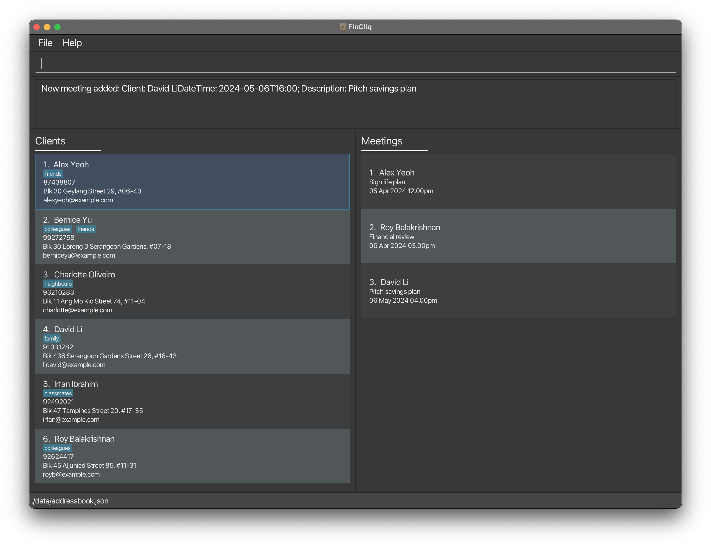
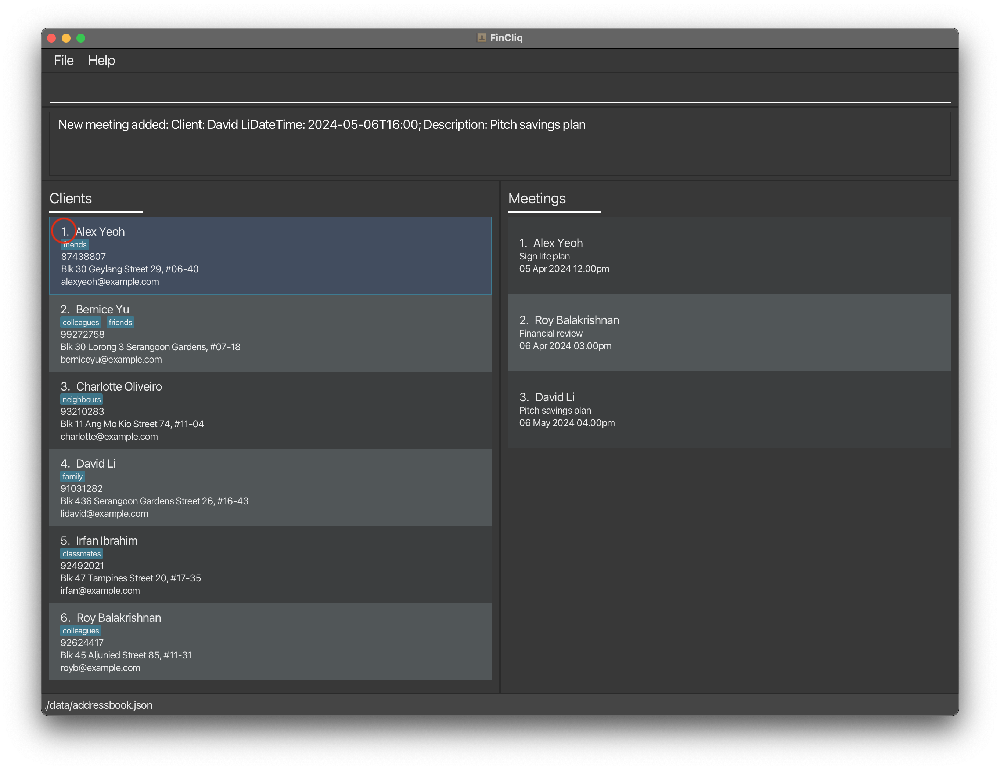
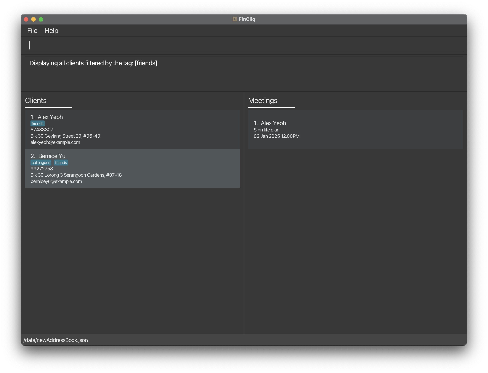
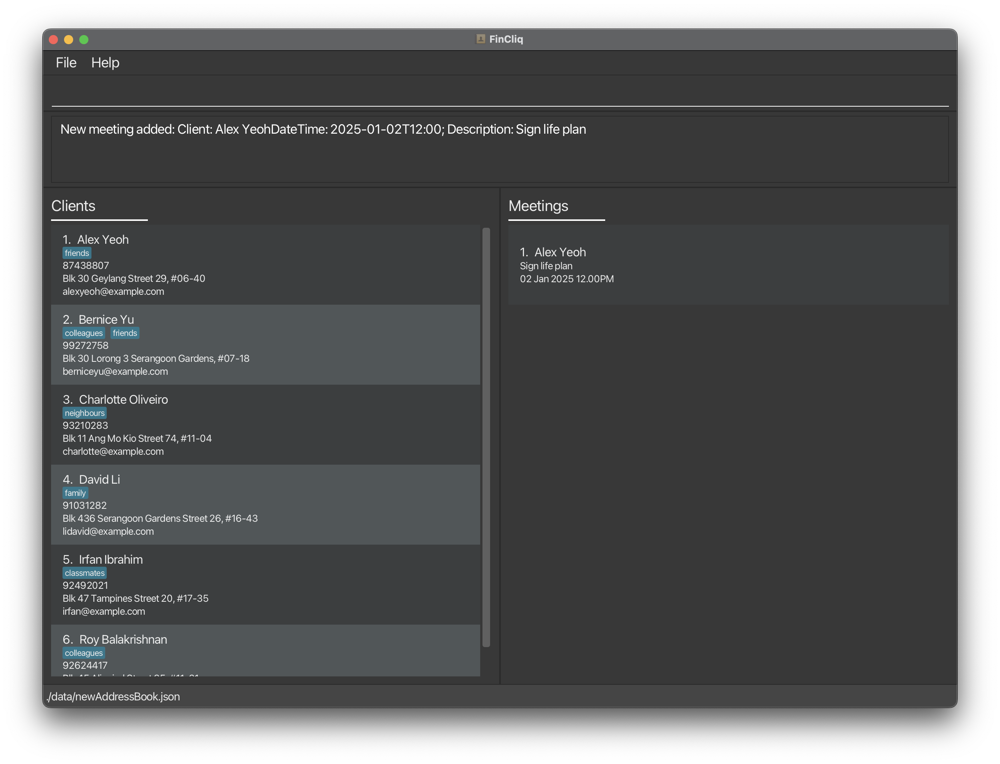
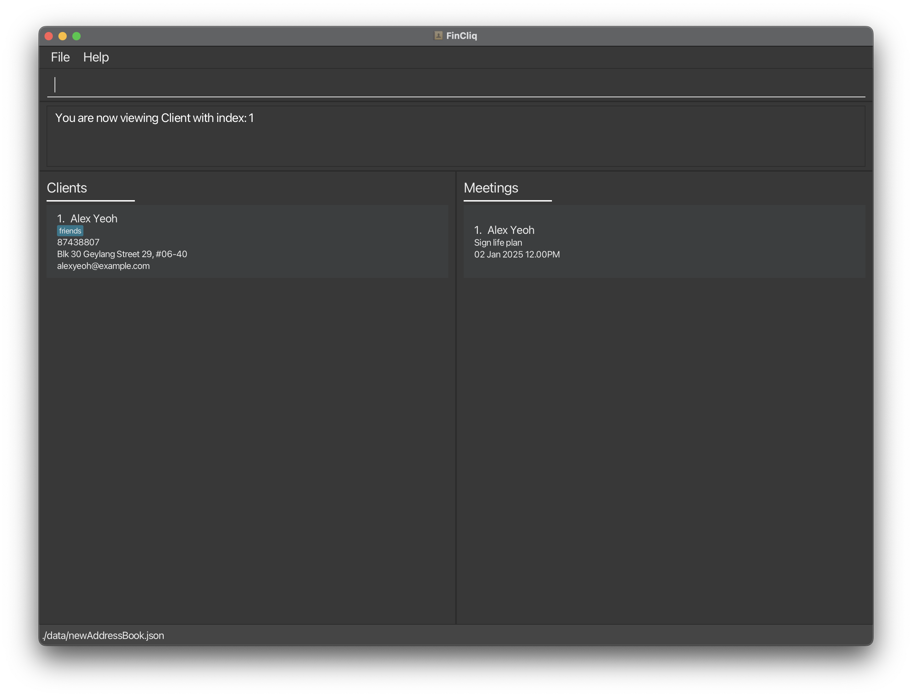
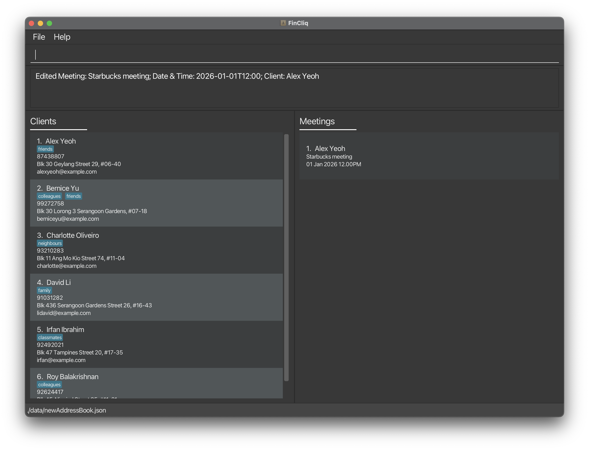
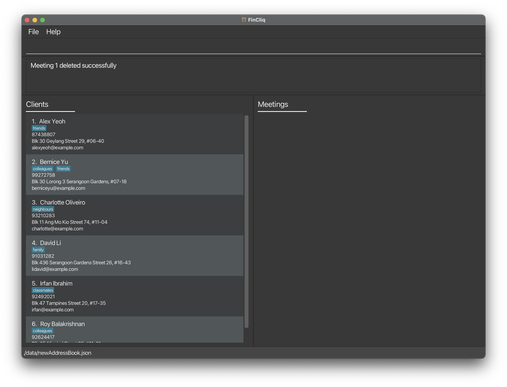

FinCliq is a **desktop app for financial advisors to manage contacts and meetings, optimized for use via a Command Line Interface** (CLI) while still having the benefits of a Graphical User Interface (GUI). If you can type fast, FinCliQ can get your contact management tasks done faster than traditional GUI apps.

---
## Table of contents

* Table of Contents
{:toc}

---

## Quick start

1. Ensure you have Java `11` or above installed in your Computer.

1. Download the latest `fincliq.jar` from [here](https://github.com/AY2324S2-CS2103-F08-1/tp/releases).

1. Copy the file to the folder you want to use as the _home folder_ for your own personal FinCliq application.

1. Open a command terminal, `cd` into the folder you put the jar file in, and use the `java -jar fincliq.jar` command to run the application. 
   A GUI similar to the below should appear in a few seconds. Note how the app contains some sample data. 
   

1. Type the command in the command box and press Enter to execute it. e.g. typing **`help`** and pressing Enter will open the help window. 
   Some example commands you can try:

    - `list` : List all clients.

    - `add n/John Doe p/98765432 e/johnd@example.com a/John street, block 123, #01-01` : Adds a 
      contact named `John Doe` to FinCliq.

    - `delete 3` : Deletes the 3rd clients shown in the current list.

    - `clear` : Deletes all clients.

    - `exit` : Exit the app.

1. Refer to the [Features](#features) below for details of each command.

---

## Features & Commands

**:information_source: Notes about the command format:** 

- Words in `UPPER_CASE` are the parameters to be supplied by the user. 
  e.g. in `add n/NAME`, `NAME` is a parameter which can be used as `add n/John Doe`.

- Items in square brackets are optional. 
  e.g. `n/NAME [t/TAG]` can be used as `n/John Doe t/friend` or as `n/John Doe`.

- Items with `…`​ after them can be used multiple times including zero times. 
  e.g. `[t/TAG]…​` can be used as ` ` (i.e. 0 times), `t/friend`, `t/friend t/family` etc.

- Parameters can be in any order. 
  e.g. if the command specifies `n/NAME p/PHONE_NUMBER`, `p/PHONE_NUMBER n/NAME` is also acceptable.

- Extraneous parameters for commands that do not take in parameters (such as `help`, `list`, `exit` and `clear`) will be ignored. 
  e.g. if the command specifies `help 123`, it will be interpreted as `help`.

- If you are using a PDF version of this document, be careful when copying and pasting commands that span multiple lines as space characters surrounding line-breaks may be omitted when copied over to the application.

**:information_source: Notes about the command input format:** 

* Spacing of values:
    * Leading and trailing spaces of input values will be removed.

* `NAME` format:
    * Can only contain alphabetical characters and spaces.
    * Cannot be blank.
    * Extra spaces between values will be processed as a single space.
    * Example: "John Doe"

* `PHONE_NUMBER` format:
    * Must follow the standard Singapore telephone numbers (i.e. 9XXXXXXX or 8XXXXXXX).
    * Spaces between numbers will be ignored.
    * Example: 91234567

* `EMAIL` format:
    * Must follow the standard email address format
    * Example: alexyeoh@example.com

* `ADDRESS` format:
    * Can only consist of alphanumeric characters, whitespace and the following set of characters: ``#-(),``.
    * Cannot be blank.
    * Example: `Blk 30 Geylang Street 29, #06-40`

* `TAG` format:
    * Can only consist of alphanumeric characters.
    * Must be a single word
    * Example: `friends`

* `DATE_TIME` format:
    * Must follow the format `DD-MM-YYYY HH:MM` 
    * Example: `02-01-2025 12:00`
  
* `CLIENT_INDEX` format: 
    * Refers to the index number shown in the displayed client list. In the example below `CLIENT_INDEX` is circled in red for added clarity.
      
    * Must be a **positive integer** 1, 2, 3, …​.
    * For `CLIENT_INDEX` to be valid, `CLIENT_INDEX` must be the index number belonging to a client in the displayed client list
  

### General Functions

#### Viewing help : `help`

Shows a message explaining how to access the help page.

Format: `help`

#### Clearing all entries : `clear`

Clear all entries from FinCliq.

Format: `clear`

#### Exiting the program : `exit`

Exits the program.

Format: `exit`

#### Saving the data

FinCliq data is saved in the hard disk automatically after any command that changes the data.
There is no need to save manually.

#### Editing the data file

FinCliq data are saved automatically as a JSON file `[JAR file location]/data/addressbook.json`. Advanced users are welcome to update data directly by editing that data file.

:exclamation: **Caution:**
If your changes to the data file makes its format invalid, FinCliq will discard all data and start with an empty data file at the next run. Hence, it is recommended to take a backup of the file before editing it. 
Furthermore, certain edits can cause FinCliq to behave in unexpected ways (e.g., if a value 
entered is outside the acceptable range). Therefore, edit the data file only if you are confident that you can update it correctly.

### Client Functions

#### Adding a client: `add`

Adds a client to FinCliq.

Format: `add n/NAME p/PHONE_NUMBER e/EMAIL a/ADDRESS [t/TAG]…​`

- The client’s name must be provided and must be alphanumeric.
- Duplicate clients with the same name are not allowed.

:bulb: **Tip:**
A client can have any number of tags (including 0)

Examples:

- `add n/John Doe p/98765432 e/johnd@example.com a/John street, block 123, #01-01`
- `add n/Betsy Crowe t/friend e/betsycrowe@example.com a/Newgate Prison p/1234567 t/criminal`

#### Listing all clients : `list`

Shows a list of all clients in FinCliq.

Format: `list`

#### Editing a client : `edit`

Edits an existing client in FinCliq.

Format: `edit CLIENT_INDEX [n/NAME] [p/PHONE] [e/EMAIL] [a/ADDRESS] [t/TAG]…​`

- Edits the client at the specified `CLIENT_INDEX`. The index refers to the index number shown in the displayed client list. The index **must be a positive integer** 1, 2, 3, …​
- At least one of the optional fields must be provided.
- Existing values will be updated to the input values.
- When editing tags, the existing tags of the client will be removed i.e. adding of tags is not 
  cumulative.
- You can remove all the client’s tags by typing `t/` without
  specifying any tags after it.

Examples:

- `edit 1 p/91234567 e/johndoe@example.com` Edits the phone number and email address of the 1st client to be `91234567` and `johndoe@example.com` respectively.
- `edit 2 n/Betsy Crower t/` Edits the name of the 2nd client to be `Betsy Crower` and clears all existing tags.

#### Locating clients by name: `find`

Finds persons whose names contain any of the given keywords.

Format: `find KEYWORD [MORE_KEYWORDS]`

- The search is case-insensitive. e.g. `hans` will match `Hans`
- The order of the keywords does not matter. e.g. `Hans Bo` will match `Bo Hans`
- Only the name is searched.
- Only full words will be matched e.g. `Han` will not match `Hans`
- Persons matching at least one keyword will be returned (i.e. `OR` search).
  e.g. `Hans Bo` will return `Hans Gruber`, `Bo Yang`

Examples:

- `find John` returns `john` and `John Doe`
- `find alex david` returns `Alex Yeoh`, `David Li` 
  

#### Deleting a client : `delete`

Deletes the specified client from FinCliq.

Format: `delete CLIENT_INDEX`

- Deletes the client at the specified `CLIENT_INDEX`.
- The index refers to the index number shown in the displayed client list.
- The index **must be a positive integer** 1, 2, 3, …​

Examples:

- `list` followed by `delete 2` deletes the 2nd client in FinCliq.
- `find Betsy` followed by `delete 1` deletes the 1st client in the results of the `find` command.

#### Filter client by tag : `filter`
Filter through clients by a specific tag provided.

Format: `filter TAG`

- `TAG` refers to the tag given to clients
- Displays all clients with the specified tag
- There should only be one tag provided else an error would be shown
- Tags should be a single word only 

Examples:
- `filter friends` Displays all clients with the tag `friends`

### Meeting Functions

#### Adding a Meeting: `addMeeting`

Adds a meeting for a specific client in FinCliq.

Format: `addMeeting clientIndex/CLIENT_INDEX dt/DATE_TIME d/DESCRIPTION`

- `CLIENT_INDEX` refers to the index number shown in the displayed client list. 
- `CLIENT_INDEX` must be a **positive integer** 1, 2, 3, …​.
- `DATE_TIME` format should be `DD-MM-YYYY HH:MM`, e.g., `02-01-2025 12:00`, and should be **after
  the current time.**
- `DESCRIPTION` refers to what the meeting is about. Format should be a single string and be alphanumeric, e.g. d/Meeting-Sales Pitch, **is not allowed.**

Rejected Scenarios:
- Different clients with the same meeting date and time but different description.
- Same client with the same meeting date and time but different description.
- Same client with the same meeting date and time and description.

Examples:

- `addMeeting clientIndex/1 dt/02-01-2025 12:00 d/Sign life plan` Adds a meeting with description "Sign life plan" and meeting date 02-01-2025 12:00 to client with index 1.
- `addMeeting clientIndex/2 dt/06-01-2025 15:00 d/Meeting to discuss finances` Adds a meeting with description "Meeting to discuss finances" and meeting date 06-01-2025 15:00 to client with index 2. 
  

#### Listing all Meetings for a Client: `view c`

Shows a list of all meetings for a specific client.

Format: `view c CLIENT_INDEX`

- `CLIENT_INDEX` refers to the index number shown in the displayed client list. 
- `CLIENT_INDEX` must be a **positive integer** 1, 2, 3, …​.
- For `CLIENT_INDEX` to be valid, `CLIENT_INDEX` must be the index number belonging to a client in the displayed client list

Example:

- `view c 1` Lists all meetings of the first client. 
  

#### Editing a Meeting: `editMeeting`

Edits an existing meeting for a client.

Format: `editMeeting clientIndex/CLIENT_INDEX meetingIndex/MEETING_INDEX n/DESCRIPTION dt/DATE_TIME`

- Edits the meeting specified by `MEETING_INDEX` for the client specified by `CLIENT_INDEX`. Both indexes must be positive integers 1, 2, 3, …​.
- All the fields (clientIndex, meetingIndex, description, datetime), must be provided.
- Existing values will be updated to the input values.
- When editing descriptions, the existing descriptions of the meeting will be removed i.e. 
  adding of descriptions is not cumulative.
- Do note that the prefix for meeting description here is "n/", not "d/". Future enhancements will include standardising prefixes across different commands.

Examples:

- `editMeeting clientIndex/1 meetingIndex/2 n/starbucks meeting dt/01-01-2024 12:00` Edits the description and date/time of the 2nd meeting of the 1st client. 
  

#### Deleting a Meeting: `deleteMeeting`

Deletes a specific meeting for a client.

Format: `deleteMeeting clientIndex/CLIENT_INDEX meetingIndex/MEETING_INDEX`

- Deletes the meeting specified by `MEETING_INDEX` for the client specified by `CLIENT_INDEX`. Both indexes must be positive integers 1, 2, 3, …​.

Example:

- `deleteMeeting clientIndex/1 meetingIndex/1` Deletes the first meeting for the first client. 
  

---

## FAQ

**Q**: I realised that persons and clients are both used in the user guide. What is the difference 
between them? 
**A**: In FinCliq, persons and clients are used interchangeably. A person is a client in FinCliq.

**Q**: How do I use the app? 
**A**: This app is designed to help you keep track of your clients and meetings with them.  
To keep track of your clients/meetings, you can follow the various commands in the user guide and enter the commands according to the specified format.

**Q**: Is there a limit to the number of clients/meetings I can store in the app 
**A**: No, there is no limit to the number.

**Q**: Are the clients/meetings storage persistent between application restarts? 
**A**: Yes. We have implemented a storage feature that would populate the information inside FinCliq based on a .json file.

**Q**: When entering my name, some characters do not show up. Is this the intended behaviour? 
**A**: Yes, currently, only our app only supports english names, although we intend to support this in the future.

**Q**: I entered a date and time that was before the current time, and it fails to add. Is this
the intended behaviour? 
**A**: Yes. We implemented this so that people would not enter meetings that occur in the past.

**Q**: I entered a meeting for the same client with the same date and time but different 
description, and it fails to add. Is this the intended behaviour? 
**A**: Yes. We implemented this with the intention that our user(financial advisor) is only booked for one type of meeting agenda at a particular date and time, to simulate real life scenario.

**Q**: I entered a meeting for a different client with the same date and time and description, 
and it succeeds to add. Is this the intended behaviour? 
**A**: Yes. We implemented this with the intention that our user(financial advisor) can be meeting two different clients, who may be friends, at the same date and time to discuss the same agenda, to simulate real life scenario where it might not always be a 1 to 1 meeting.

---

## Known issues

1. **When using multiple screens**, if you move the application to a secondary screen, and later switch to using only the primary screen, the GUI will open off-screen. The remedy is to delete the `preferences.json` file created by the application before running the application again.
2. **When entering a command with an invalid format**, the application will prompt you to re-enter the command while providing the correct format to follow.

---

## Command summary

### Client Functions

| Action     | Format, Examples                                                                                                                                                     |
|------------|----------------------------------------------------------------------------------------------------------------------------------------------------------------------|
| **Add**    | `add n/NAME p/PHONE_NUMBER e/EMAIL a/ADDRESS [t/TAG]…`   e.g., `add n/James Ho p/22224444 e/jamesho@example.com a/123, Clementi Rd, 1234665 t/friend t/colleague` |
| **List**   | `list`  e.g., `list`                                                                                                                                              |
| **Edit**   | `edit CLIENT_INDEX [n/NAME] [p/PHONE_NUMBER] [e/EMAIL] [a/ADDRESS] [t/TAG]…`  e.g.,`edit 2 n/James Lee e/jameslee@example.com`                                    |
| **Delete** | `delete CLIENT_INDEX`  e.g., `delete 3`                                                                                                                       |
| **Find**   | `find KEYWORD [MORE_KEYWORDS]`  e.g., `find James Jake`                                                                                                           |
| **Filter** | `filter TAG_NAME`  e.g., `filter friends`                                                                                                                         |

### Meeting Functions

| Action     | Format, Examples                                                                                                                                                                       |
|------------|----------------------------------------------------------------------------------------------------------------------------------------------------------------------------------------|
| **Add**    | `addMeeting clientIndex/CLIENT_INDEX dt/DATE_TIME d/DESCRIPTION` e.g., `addMeeting clientIndex/1 dt/02-01-2025 12:00 d/Sign life plan`                                              |
| **View**   | `view c CLIENT_INDEX` e.g., `view c 2`                                                                                                                                              |
| **Edit**   | `editMeeting clientIndex/CLIENT_INDEX meetingIndex/MEETING_INDEX n/DESCRIPTION d/DATE_TIME` e.g.,`editMeeting clientIndex/1 meetingIndex/2 n/starbucks meeting dt/01-01-2025 12:00` |
| **Delete** | `deleteMeeting clientIndex/CLIENT_INDEX meetingIndex/MEETING_INDEX` e.g., `deleteMeeting clientIndex/2 meetingIndex/1`                                                              |

### General Functions

| Action    | Format, Examples |
|-----------|------------------|
| **Clear** | `clear`          |
| **Help**  | `help`           |
| **Exit**  | `exit`           |
